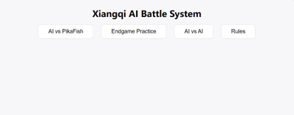
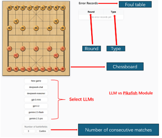
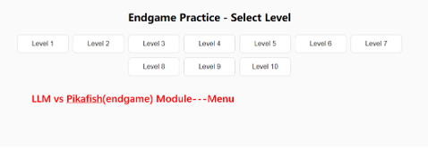
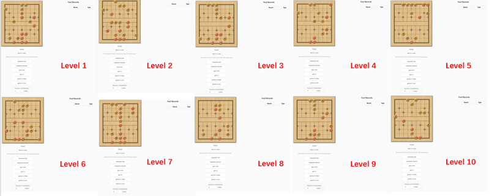
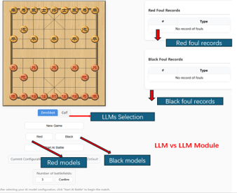

# Xiangqi-LLMs-reasoning-consistency

A Xiangqi-based experimental framework for evaluating the reasoning consistency of large language models in continuous decision-making environments.

---

## Overview

This project uses **Xiangqi (Chinese chess)** as a structured and rule-based environment to evaluate whether large language models can maintain **stable and rule-consistent reasoning** across continuous and similar decision-making tasks.

Instead of focusing only on single-turn correctness, this system studies how LLMs behave over multiple rounds in a sequential game environment.

The project contains three main modules:

- **LLM vs Pikafish**  
  Tests whether an LLM can keep making legal and stable moves against the Xiangqi engine Pikafish.

- **LLM vs Pikafish (Endgame)**  
  Tests whether an LLM can solve controlled endgame tasks that require several consecutive correct moves.

- **LLM vs LLM**  
  Tests how reasoning consistency changes when one LLM plays directly against another.

Supported model families in this project include:

- DeepSeek
- OpenAI
- Gemini

---

## UI Preview

### Main Menu



---

### LLM vs Pikafish Module



---

### Endgame Level Selection



---

### Endgame Module



---

### LLM vs LLM Module



---

## How to Run

### 1. Requirements

Make sure you have:

- Java
- Maven or Maven Wrapper
- Internet connection
- Your own API keys
- Windows environment if you use the included `pikafish-avx2.exe`

---

### 2. Configure API Keys

This project uses `application.properties` with environment-variable placeholders.

In:

```text
src/main/resources/application.properties
```

the API key settings should look like this:

```properties
deepseek.api.key=${DEEPSEEK_API_KEY}
openai.api.key=${OPENAI_API_KEY}
gemini.api.key=${GEMINI_API_KEY}
```

This means you should **not** write your real API keys directly into the file.  
Instead, define them as environment variables on your computer or in your IntelliJ run configuration.

Example variable names:

- `DEEPSEEK_API_KEY`
- `OPENAI_API_KEY`
- `GEMINI_API_KEY`

---

### 3. Start the Backend

Run the Spring Boot application with:

```bash
mvnw.cmd spring-boot:run
```

or run:

```text
XiangqiApplication.java
```

directly in IntelliJ.

---

### 4. Open the Frontend

After the project starts, open your browser and go to:

```text
http://localhost:8080
```

This will open the main menu page of the system.

---

## Frontend Pages

The main frontend files are under:

```text
src/main/resources/static/
```

They include:

- `index.html` — main menu page
- `play.html` — LLM vs Pikafish module
- `endgame.html` — endgame module
- `individual.html` — LLM vs LLM module
- `Rules.html` — Xiangqi rules page

The chess piece images and related frontend assets are stored in:

```text
src/main/resources/static/images/
```

---

## Code Structure

Main backend code is under:

```text
src/main/java/com/example/xiangqi/
```

### `engine/`
Engine integration logic.

- `EngineService.java`

### `game/`
Core Xiangqi rules and game logic.

Examples:

- `XqRules.java`
- `XqPlayJuge.java`
- `XqIndividualJuge.java`
- `XqEndgameJudge.java`
- `XqEndgameRule.java`
- `GameExecutor.java`

### `llm/`
LLM-related logic, including board description, API calls, and foul recording.

Examples:

- `BoardStateDescriber.java`
- `AIBoardDescriber.java`
- `DeepseekClient.java`
- `GeminiClient.java`
- `OpenAIClient.java`
- `DeepseekCotClient.java`
- `GeminiCotClient.java`
- `OpenAICotClient.java`
- `ErrorCsvRecorder.java`

### `service/`
Higher-level experimental services, especially for endgame evaluation.

Examples:

- `DeepSeekEndgameService.java`
- `GeminiEndgameService.java`
- `OpenAIEndgameService.java`
- `EndgameAccuracyService.java`
- `EndgameStandardSolutions.java`
- `MoveComparison.java`

### `web/`
Spring controllers connecting frontend pages and backend logic.

Examples:

- `EndgameController.java`
- `ContinuousBattleController.java`
- `IndividualController.java`
- `XiangqiAIController.java`
- `XiangqiAICotController.java`
- `DeepseekController.java`
- `GeminiController.java`
- `OpenAIController.java`

---

## CSV Saving Mechanism

This project records some experimental outputs and error information into CSV files.

CSV files are used to store data such as:

- illegal move / foul records
- endgame results
- repeated battle outputs
- model behavior statistics

CSV-related recording is mainly handled by:

- `ErrorCsvRecorder.java`

Some result-related directories may also be used for storing experimental outputs under `resources`, depending on the module and configuration.

> In the public GitHub version, some CSV experiment outputs may be removed or ignored to keep the repository clean.  
> If you run experiments locally, new CSV files may still be generated depending on the module logic.

---

## Engine Files

The Pikafish engine files are stored in:

```text
src/main/resources/engine/
```

They include:

- `pikafish-avx2.exe`
- `pikafish.nnue`

These are required for modules that use Pikafish.

---

## Summary

In short, this project is a **Xiangqi-based LLM evaluation system** for testing whether language models can maintain **reasoning consistency** in long-horizon, rule-based, and repeated decision-making settings.

It provides:

- a Spring Boot backend
- static HTML frontend pages
- LLM API integration
- Pikafish engine integration
- rule checking
- CSV-based experiment recording
